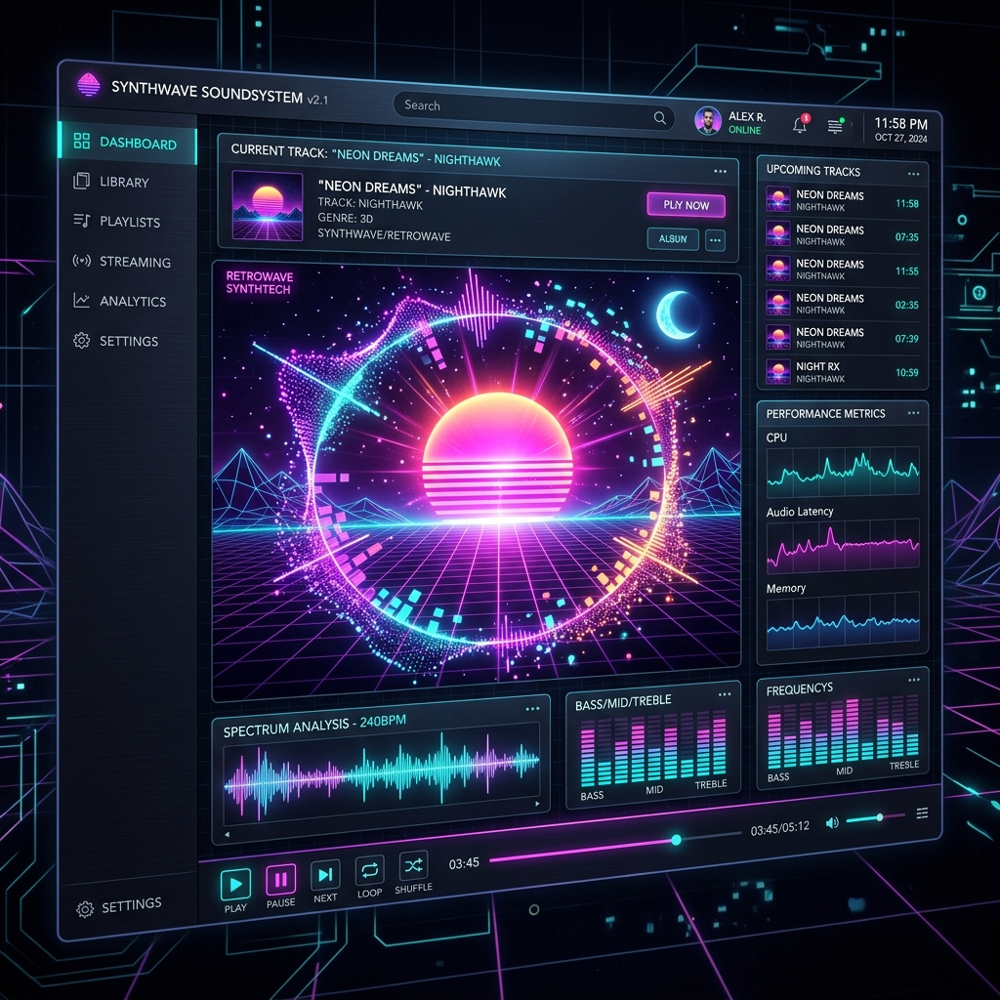
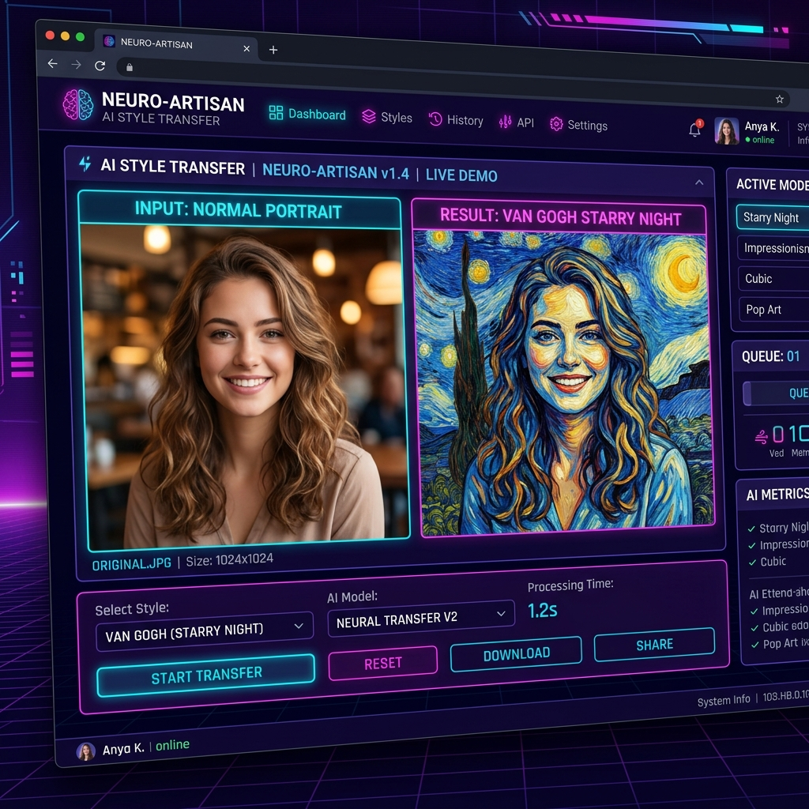

# Synthwave AI Portal

## 1. Overview (Tổng quan)
**Synthwave AI Portal** là một ứng dụng web mô phỏng không gian Cyberpunk / Synthwave, tích hợp hai mô-đun Trí tuệ Nhân tạo (AI) chạy độc lập trên trình duyệt:
- **AI Music Visualizer:** Hệ thống phân tích phổ âm thanh (Audio Spectrum Analysis) theo thời gian thực kết hợp cùng công nghệ WebGL (Three.js) để khởi tạo không gian 3D tương tác.
- **In-Browser Style Transfer:** Hệ thống chuyển đổi phong cách hình ảnh (Neural Style Transfer) sử dụng TensorFlow.js. Mô hình học sâu (Deep Learning Model) được thực thi hoàn toàn ở phía máy khách (client-side), đảm bảo không truyền tải dữ liệu hình ảnh qua internet.



## 2. Architecture (Kiến trúc hệ thống)
Dự án được xây dựng theo kiến trúc Backend/Frontend phân tách rõ ràng nhưng được đóng gói chung thông qua FastAPI để thuận tiện cho quá trình triển khai cục bộ (local deployment).

- **Backend (Python 3.10+):** Sử dụng `FastAPI` và `Uvicorn` để xử lý định tuyến (routing) và cung cấp các tệp tĩnh (static files).
- **Frontend (Vanilla HTML/CSS/JS):**
  - Giao diện: CSS thuần kết hợp các hiệu ứng Glassmorphism và Grid Animation.
  - Xử lý 3D & Âm thanh: `Three.js` và `Web Audio API`.
  - Học máy (Machine Learning): `TensorFlow.js` (Graph Model).



## 3. Directory Structure (Cấu trúc thư mục)
Dự án tuân thủ tiêu chuẩn cấu trúc ứng dụng FastAPI kết hợp AI:

```text
D:\synthwave_ai_portal\
├── app/                  # Chứa logic backend (FastAPI)
│   ├── api/              # Cấu trúc dành cho việc mở rộng REST API sau này
│   ├── core/             # Cấu trúc dành cho cấu hình (settings, security)
│   ├── main.py           # Điểm khởi chạy chính của ứng dụng
│   └── __init__.py
├── assets/               # Chứa các tài nguyên thiết kế thô, dữ liệu dự phòng
├── docs/                 # Tài liệu dự án và hình ảnh minh họa (mockups)
├── scripts/              # Các script tự động hóa cài đặt môi trường
├── static/               # Source code giao diện người dùng (Frontend)
│   ├── css/              # Bảng định kiểu (Style.css)
│   ├── js/               # Mã kịch bản Frontend (main.js, visualizer.js, style_transfer.js)
│   ├── index.html        # Trang chủ Portal
│   ├── visualizer.html   # Giao diện AI Music Visualizer
│   └── style_transfer.html # Giao diện Style Transfer
├── venv/                 # Môi trường ảo Python (Virtual Environment)
├── requirements.txt      # Danh sách thư viện phụ thuộc
├── .gitignore            # Danh sách loại trừ cho Git
└── README.md             # Tài liệu này
```

## 4. Prerequisites (Yêu cầu hệ thống)
- **Hệ điều hành:** Windows 10/11, macOS, hoặc Linux.
- **Ngôn ngữ:** Python 3.10 trở lên.
- **Trình duyệt:** Cần sử dụng trình duyệt phiên bản mới (Chrome, Edge, Firefox) hỗ trợ WebGL 2.0 và WebAssembly (WASM). Khuyến nghị thiết bị có GPU rời để tối ưu hóa quá trình tính toán của TensorFlow.js.

## 5. Installation (Cài đặt)
Mở terminal / PowerShell và chạy các lệnh sau để thiết lập môi trường:

```powershell
# 1. Khởi tạo môi trường ảo (venv)
rtk python -m venv venv

# 2. Kích hoạt môi trường ảo (Dành cho Windows PowerShell)
# LƯU Ý: Không dùng tiền tố rtk cho lệnh kích hoạt vì script .ps1 không phải là tệp thực thi.
.\venv\Scripts\Activate.ps1

# 3. Cài đặt các thư viện yêu cầu
rtk pip install -r requirements.txt
```

## 6. Usage (Sử dụng)

Khởi động máy chủ ứng dụng:
```powershell
rtk uvicorn app.main:app --reload
```
Sau khi dòng thông báo khởi động thành công xuất hiện, truy cập [http://localhost:8000](http://localhost:8000) trên trình duyệt.

- **Module 1 - Music Visualizer:** Tải tệp `.mp3` lên và nhấn `Play`. Biểu đồ hạt và lưới không gian sẽ phản hồi theo cường độ dải tần (tần số bass ảnh hưởng đến bán kính trung tâm).
- **Module 2 - Style Transfer:** Tải tệp `.jpg`/`.png` làm nội dung và chọn hình ảnh phong cách mẫu. Nhấn `Stylize Image` để bắt đầu xử lý.

## 7. Troubleshooting & FAQ (Xử lý sự cố)

1. **Lỗi không nhận diện lệnh `uvicorn`:** Đảm bảo bạn đã kích hoạt môi trường ảo `venv` trước khi chạy.
2. **Quá trình Style Transfer mất quá nhiều thời gian:** Lần tải mô hình đầu tiên (khoảng 10MB) phụ thuộc vào tốc độ mạng. Ở các lần sau, tệp mô hình sẽ được lưu vào cache trình duyệt. Nếu máy thiếu GPU, tốc độ suy luận (inference) bằng CPU có thể mất tới 15-30 giây cho một bức ảnh.
3. **Lỗi đường dẫn `static` không tìm thấy:** Chắc chắn bạn khởi động `uvicorn app.main:app` từ vị trí gốc của dự án (`D:\synthwave_ai_portal`), không khởi chạy từ bên trong thư mục `app/`.

## 8. License
Dự án được xây dựng phục vụ mục đích trình diễn công nghệ (Tech Demo) và học thuật.
